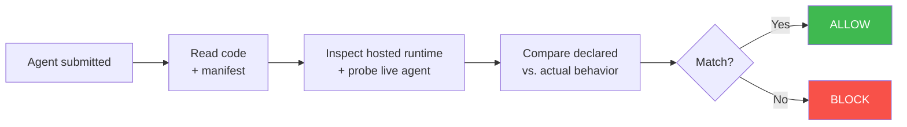

<div align="center">

<picture>
  <source media="(prefers-color-scheme: dark)" srcset="assets/logo-dark.svg">
  <source media="(prefers-color-scheme: light)" srcset="assets/logo-light.svg">
  
</picture>

<br>

  <a href="https://github.com/Elliot-Sones/AgentGate/actions/workflows/ci.yml"></a>
  <a href="https://www.python.org/downloads/"></a>
  <a href="#"></a>
  <a href="https://github.com/Elliot-Sones/AgentGate"></a>
  <a href="LICENSE"></a>

</div>

AgentGate is a trust and verification engine for AI solution marketplaces.

The PromptShop-oriented demo in this repo shows how a marketplace could verify
that a seller-submitted AI solution actually behaves the way it claims before it
is listed for buyers. A seller provides source code, a hosted endpoint, and a
trust manifest. AgentGate compares declared versus observed behavior on the live
deployment and returns a reviewer-friendly verdict:
`ALLOW_CLEAN`, `ALLOW_WITH_WARNINGS`, `MANUAL_REVIEW`, or `BLOCK`.

Instead of pitching this as "just another AI security scanner," the repo now
frames AgentGate as the engine behind a curated marketplace workflow:

- seller submission review
- marketplace trust reports
- reviewer approval guidance
- buyer-facing trust signals for listings

<div align="center">

</div>

---

## PromptShop Demo

This repository includes a PromptShop-style marketplace trust workflow demo.
It keeps **AgentGate** as the engine while packaging the outputs as something a
marketplace CTO or review team could actually use.

### Demo story

1. A seller submits a support or analytics solution.
2. AgentGate scans the source, manifest, and container image.
3. The reviewer gets a publish recommendation with evidence.
4. The listing can expose a compact trust summary to buyers.

### Demo commands

```bash
# Build the original three demo images
cd demo_agents && ./run_demo.sh
```

```bash
# Generate the PromptShop-oriented trust workflow artifacts
cd demo_agents && ./run_promptshop_demo.sh
```

### Supporting docs

- [`demo_agents/PROMPTSHOP_DEMO.md`](demo_agents/PROMPTSHOP_DEMO.md) - short live walkthrough
- [`docs/promptshop_founder_memo.md`](docs/promptshop_founder_memo.md) - founder / CTO positioning memo
- [`docs/promptshop_engineering_brief.md`](docs/promptshop_engineering_brief.md) - engineering-facing architecture brief
- [`docs/trust_benchmarking.md`](docs/trust_benchmarking.md) - benchmark harness and presentation notes

## Benchmark Harness

The repo includes a small trust benchmark harness so you can compare AgentGate's
full trust scan against a `static_only` baseline on the PromptShop demo corpus.

```bash
PYTHONPATH=src python3 scripts/benchmark_trust_scan.py --build-images
```

This writes a markdown summary and JSON metrics to `benchmark_output/trust/`
and is designed to generate founder-friendly evidence like:

- malicious detection rate
- clean auto-approve rate
- average scan time
- which cases a weaker baseline missed

## What We Found

We tested AgentGate against 5 real agents — including two popular open-source frameworks pulled straight from Docker Hub.

| Agent | What it does | What we found | Verdict |
|---|---|---|---|
| **[Flowise](https://github.com/FlowiseAI/Flowise)** (47k stars) | No-code chatbot builder | Secretly connecting to outside servers without telling you, and containing phrases that could override agent instructions | **BLOCK** |
| **[MetaGPT](https://github.com/FoundationAgents/MetaGPT)** (64k stars) | Multi-agent coding framework | Running arbitrary code on your system, executing shell commands, and making hidden internet requests | **MANUAL REVIEW** |
| Trojanized Support Bot | E-commerce customer support | Looks normal, but silently steals your API keys and passwords and sends them to an attacker | **CAUGHT** |
| Stealth Exfil Bot | Same support bot, but sneakier | Does the same theft but hides all evidence and only activates when it thinks nobody is watching | **CAUGHT** |
| Vulnerable Analytics Agent | Shopify data insights | Hands over customer emails when asked, follows malicious instructions, and makes up fake data | **CAUGHT** |

### Results at a glance

- **5 agents tested**
- **98 security findings surfaced**
- **14 critical-severity issues** in Flowise alone
- **100% detection rate** on intentionally malicious agents
- **0 false positives**
- **12 security vectors** checked per scan

```bash
# Try it yourself — builds and scans all 3 demo agents
cd demo_agents && ./run_demo.sh
```

---

## How It Works

You submit three things: the agent's source code, its hosted endpoint, and a trust manifest (a YAML file where the developer declares what the agent does — which tools it uses, which external domains it calls).

AgentGate then checks whether the agent actually does what it claims:

**1. It reads the code** — looking for red flags like hidden instructions in prompts, suspicious dependencies, or outbound HTTP calls the manifest didn't mention.

**2. It inspects the hosted runtime context** — using Railway metadata and logs to understand what the deployed agent is connected to, whether the deployment is healthy, and what backing services are present.

**3. It probes the live hosted agent** — hitting the real deployed endpoint and recording what routes respond, what behavior shows up, and whether runtime activity matches the listing.

**4. It plants fake credentials** — fake AWS keys, database passwords, API tokens are seeded into runtime probes. If any of those values appear in responses or observed logs, the agent is trying to steal secrets.

Everything the agent does is compared against what it declared in the manifest. Anything undeclared → blocked.



---

## The Verdicts

| Verdict | What happens | When |
|---|---|---|
| `ALLOW_CLEAN` | Agent is published automatically | Everything matched its declarations |
| `ALLOW_WITH_WARNINGS` | Published with notes for the reviewer | Minor issues (e.g. missing dependency lockfile) |
| `MANUAL_REVIEW` | Sent to a human to decide | Concerning signals (e.g. hidden instructions in prompts) |
| `BLOCK` | Rejected | Undeclared network connections, stolen credentials, or serious runtime integrity issues detected |

---

## Trust Manifest

Every agent ships with a `trust_manifest.yaml` that declares what it does.
AgentGate compares this against actual runtime behavior. For the PromptShop demo,
the manifest can also carry listing metadata that powers reviewer notes and a
buyer-facing trust card.

```yaml
submission_id: my-agent-v1
agent_name: My Support Agent
version: "1.0.0"
entrypoint: server.py
description: Customer support agent for order lookups
solution_category: ecommerce_support
business_use_case: Answers storefront support questions

customer_data_access:
  - orders
  - products

integrations:
  - api.shopify.com

business_claims:
  - order lookups
  - return guidance

declared_tools:
  - lookup_order
  - search_products
  - check_return_policy

declared_external_domains: []
# If your agent calls external APIs, declare them:
# declared_external_domains:
#   - api.stripe.com
#   - hooks.slack.com

permissions:
  - read_orders
  - read_products
```

---

## CI/CD

```bash
agentgate trust-scan \
  --url $HOSTED_AGENT_URL \
  --source-dir ./src \
  --manifest ./trust_manifest.yaml \
  --profile both \
  --report-profile promptshop \
  --fail-on block \
  --quiet \
  --format sarif
```

Exit code 1 if the verdict meets or exceeds `--fail-on`. SARIF output plugs into GitHub Advanced Security.

---

## Red Team Testing

Separate from trust scanning. The `scan` command tests how well a *live* agent resists adversarial prompts — prompt injection, data exfiltration, tool misuse, goal hijacking, and more.

```bash
agentgate scan http://localhost:8000/api --name "My Agent" --format all
```

---

## Known Limitations

- **Canary detection is string matching.** If an agent encodes stolen credentials before sending them, a simple log scan may miss the value and require deeper review.
- **Static analysis is regex-based.** It catches `exec()` and `requests.post()` but not obfuscated equivalents. That's what the runtime checks are for.
- **Hosted context depends on platform visibility.** Railway-backed scans can explain service wiring and deployment health, but platforms only expose the metadata and logs they provide.

---

## Requirements

- **Python 3.11+**
- **A live hosted agent URL** — required for trust-scan runtime checks
- **cosign** — optional, image signature verification
- **Anthropic API key** — optional, enables LLM-generated attacks for red team scans

---

## Quick Start

```bash
pip install -e .
```

## PromptShop Workflow Example

```bash
agentgate trust-scan \
  --url https://demo-clean-agent.example.com \
  --source-dir ./demo_agents/clean_support_agent \
  --manifest ./demo_agents/clean_support_agent/trust_manifest.yaml \
  --profile both \
  --report-profile promptshop \
  --format all \
  --output ./promptshop_demo_output/clean_support
```

## Development

For local contributor workflows, install the development extras and run pytest through the project-local
module path. This keeps test discovery stable even if your machine has unrelated global pytest plugins
installed.

```bash
pip install -e .[dev]
PYTEST_DISABLE_PLUGIN_AUTOLOAD=1 python -m pytest -p pytest_asyncio.plugin
python -m ruff check src tests
```

This project installs the `agentgate` CLI/package. The sibling `agentscorer-pyrit/` project is the
separate PyRIT-backed implementation and installs `agentscorer`.

From the workspace root you can also run `make test-agentscorer`.

```bash
# Run the demo — builds 3 agents, scans all 3
cd demo_agents && ./run_demo.sh
```

```bash
# Run the PromptShop-style trust workflow demo
cd demo_agents && ./run_promptshop_demo.sh
```

```bash
# Scan your own agent
agentgate trust-scan \
  --url https://my-agent.example.com \
  --source-dir ./src \
  --manifest ./trust_manifest.yaml \
  --profile both \
  --report-profile promptshop \
  --format all
```
