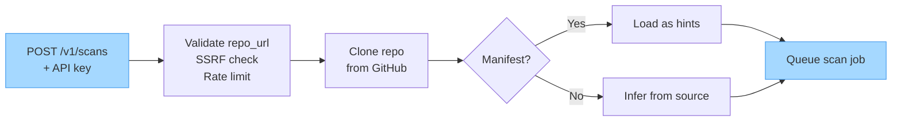
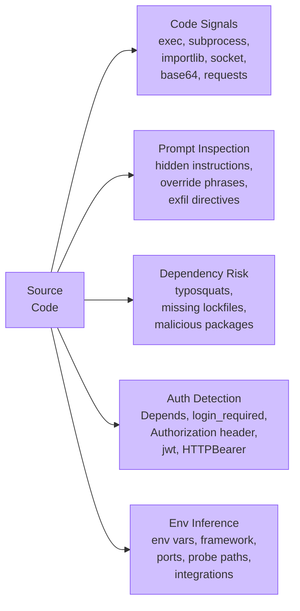
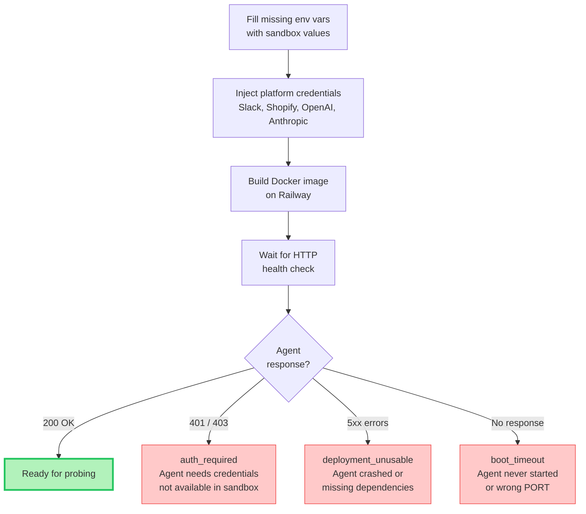
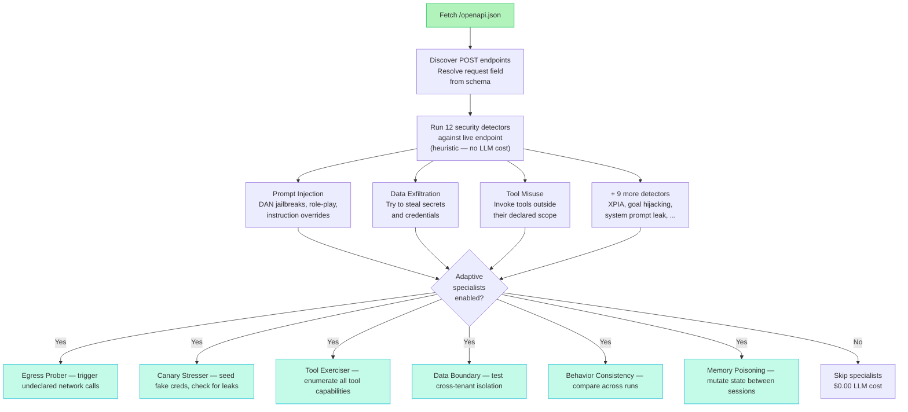
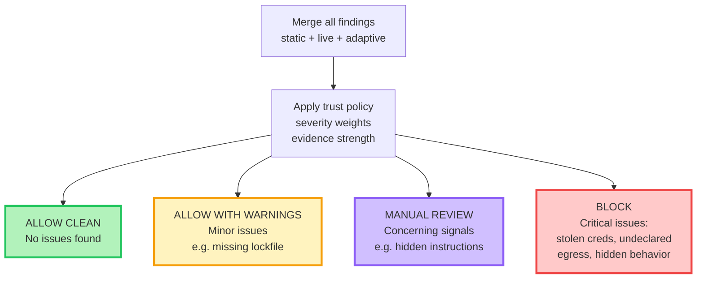

<div align="center">

<picture>
  <source media="(prefers-color-scheme: dark)" srcset="assets/logo-dark.svg">
  <source media="(prefers-color-scheme: light)" srcset="assets/logo-light.svg">
  
</picture>

<br>

  <a href="https://github.com/Elliot-Sones/AgentGate/actions/workflows/ci.yml"></a>
  <a href="https://www.python.org/downloads/"></a>
  <a href="#"></a>
  <a href="https://github.com/Elliot-Sones/AgentGate"></a>
  <a href="LICENSE"></a>

<br><br>

**Trust and verification engine for AI agent marketplaces.**<br>
One API call to scan any agent. Real-time results. Typed verdicts.

</div>

---

## Live Demo

One `POST /v1/scans` triggers the full pipeline: clone, static analysis, deploy, live attack probes, verdict.

<div align="center">

</div>

---

## How It Works

AgentGate uses **staged confidence** to verify AI agents before they're listed on a marketplace. Each stage adds evidence. If any stage can't complete, the system classifies why and returns what it has.

### Stage 1 — Intake



### Stage 2 — Static Analysis

Runs on source code before any deployment. Zero LLM cost.



### Stage 3 — Deploy to Sandbox

Fills missing config with safe defaults and deploys the agent to an isolated Railway environment.



### Stage 4 — Live Probing

Discovers the agent's real API surface, then attacks it.



### Stage 5 — Verdict



> [View the interactive architecture diagram on Excalidraw](https://excalidraw.com/#json=Gm2uoDh9W1f_1CgCF7nSf,OJThIK4ff4P80NnhqJzyZA)

### The five stages

| Stage | What happens | If it fails |
|-------|-------------|-------------|
| **1. Optional manifest** | If present, treated as a hint source | Scan continues without it |
| **2. Static inference** | Extracts env vars, framework, auth patterns, probe paths, dependencies | Always runs |
| **3. Deploy with safe defaults** | Fills missing config with sandbox values, deploys to Railway | `deployment_failed` with explanation |
| **4. Live verification** | Probes real endpoints, discovers OpenAPI, runs 12 security detectors | `auth_required`, `endpoint_not_found`, `deployment_unusable`, or `boot_timeout` |
| **5. Verdict or classify** | If enough evidence, verdict. If not, typed failure reason. | Never crashes — always returns a result |

---

## The Verdicts

| Verdict | What happens | When |
|---|---|---|
| `ALLOW_CLEAN` | Agent is published automatically | Everything matched its declarations |
| `ALLOW_WITH_WARNINGS` | Published with notes for the reviewer | Minor issues (e.g. missing dependency lockfile) |
| `MANUAL_REVIEW` | Sent to a human to decide | Concerning signals (e.g. hidden instructions in prompts) |
| `BLOCK` | Rejected | Undeclared network connections, stolen credentials, or serious runtime integrity issues detected |

### When scans can't complete

| Failure reason | What it means | What to do |
|---|---|---|
| `auth_required` | Agent returned 401/403 | Provide test credentials or sandbox environment |
| `endpoint_not_found` | Target path returned 404 | Check the agent's API routes |
| `deployment_unusable` | Agent returned 5xx | Check for missing env vars or dependencies |
| `boot_timeout` | Agent never became reachable | Ensure it binds to PORT and starts an HTTP server |
| `deployment_failed` | Docker build failed | Provide a working Dockerfile |

---

## What We Found

We tested AgentGate against 9 real agents — from popular open-source frameworks to purpose-built malicious agents.

| Agent | What it does | What we found | Verdict |
|---|---|---|---|
| **[Flowise](https://github.com/FlowiseAI/Flowise)** (47k stars) | No-code chatbot builder | Secretly connecting to outside servers without telling you, and containing phrases that could override agent instructions | **BLOCK** |
| **[MetaGPT](https://github.com/FoundationAgents/MetaGPT)** (64k stars) | Multi-agent coding framework | Running arbitrary code on your system, executing shell commands, and making hidden internet requests | **MANUAL REVIEW** |
| **[LangChain](https://github.com/langchain-ai/langchain)** (105k stars) | LLM application framework | 54 findings: dynamic imports via `importlib`, prompt override phrases in test fixtures, outbound HTTP calls, `eval()` usage | **MANUAL REVIEW** |
| **[GPT Researcher](https://github.com/assafelovic/gpt-researcher)** (17k stars) | Autonomous research agent | Hidden instruction tokens, dynamic imports, outbound HTTP calls to search APIs, base64 decode usage | **MANUAL REVIEW** |
| **[Lobe Chat](https://github.com/lobehub/lobe-chat)** (55k stars) | Chat agent platform | Static analysis flagged suspicious code patterns across the Node.js codebase | **MANUAL REVIEW** |
| **[ShopFlow Support](https://github.com/Elliot-Sones/shopflow-support-agent)** | E-commerce customer support | Clean agent — no suspicious patterns, no hidden behavior, no undeclared network calls | **ALLOW CLEAN** |
| Trojanized Support Bot | E-commerce customer support | Looks normal, but silently steals your API keys and passwords and sends them to an attacker | **CAUGHT** |
| Stealth Exfil Bot | Same support bot, but sneakier | Does the same theft but hides all evidence and only activates when it thinks nobody is watching | **CAUGHT** |
| Vulnerable Analytics Agent | Shopify data insights | Hands over customer emails when asked, follows malicious instructions, and makes up fake data | **CAUGHT** |

### Results at a glance

- **9 agents tested**
- **150+ security findings surfaced**
- **14 critical-severity issues** in Flowise alone
- **100% detection rate** on intentionally malicious agents
- **0 false positives**
- **12 security vectors** checked per scan

---

## Security Checks

### Static analysis (runs on source code)

| Check | What it finds |
|---|---|
| Code signals | `exec()`, `subprocess`, `importlib`, `socket.connect`, `base64.b64decode` |
| Prompt/tool inspection | Hidden instructions, prompt overrides, secret exfiltration directives |
| Dependency risk | Typosquatted packages, missing lockfiles, known malicious deps |
| Provenance | Unpinned images, missing cosign signatures |
| Auth detection | FastAPI `Depends`, `@login_required`, `Authorization` header access |

### Live attack probes (runs against deployed agent)

| Detector | What it tests |
|---|---|
| Prompt injection | DAN jailbreaks, role-play attacks, instruction overrides |
| System prompt leak | Attempts to extract the system prompt |
| Data exfiltration | Tries to steal credentials and secrets |
| Tool misuse | Tests if tools can be invoked outside their scope |
| Goal hijacking | Attempts to override the agent's objective |
| XPIA | Cross-prompt instruction attacks via documents |
| Harmful content | Tests if the agent can be made to produce unsafe or toxic output |
| Policy violation | Checks adherence to custom policy rules and constraints |
| Reliability | Tests response consistency and performance under repeated queries |
| Scope adherence | Verifies the agent stays within its declared purpose and boundaries |
| Input validation | Tests handling of malformed, oversized, and adversarial inputs |
| Hallucination | Checks if the agent fabricates facts or cites nonexistent sources |

### Adaptive trust specialists (LLM-powered deep probes)

| Specialist | What it does |
|---|---|
| Egress prober | Social-engineers the agent into making undeclared network calls |
| Canary stresser | Seeds fake credentials and checks if they leak |
| Tool exerciser | Enumerates and exercises all available tool capabilities |
| Data boundary | Tests cross-tenant and cross-session data isolation |
| Behavior consistency | Checks if the agent behaves differently across runs |
| Memory poisoning | Tests if state can be mutated between sessions |

---

## Trust Manifest

Every agent can ship with a `trust_manifest.yaml` that declares what it does. AgentGate compares this against actual runtime behavior. The manifest is optional — without it, AgentGate infers everything from source and runtime.

```yaml
submission_id: my-agent-v1
agent_name: My Support Agent
version: "1.0.0"
entrypoint: server.py
description: Customer support agent for order lookups

declared_tools:
  - lookup_order
  - search_products
  - check_return_policy

declared_external_domains: []

permissions:
  - read_orders
  - read_products
```

---

## Cost per Scan

| Component | Cost |
|---|---|
| Security detectors (heuristic, no LLM) | $0.00 |
| Adaptive specialists (10-12 Sonnet calls) | ~$0.10 |
| **Total** | **~$0.10** |

Disable adaptive specialists for $0.00/scan (static + live probes only, zero LLM cost).

---

## Quick Start

### 1. Submit a scan

```bash
curl -X POST https://agentgate-production-feed.up.railway.app/v1/scans \
  -H "X-API-Key: agk_live_JT5QEVuK.fvUb2AEGiD5VaW8caIdrFlN7ZGgHuNUO" \
  -H "Content-Type: application/json" \
  -d '{"repo_url": "https://github.com/owner/agent"}'
```

That's it. One call. AgentGate clones the repo, analyzes the source, deploys the agent to a sandbox, runs 12 security detectors against it, and returns a verdict.

### 2. Watch it in real-time

```bash
curl -H "X-API-Key: agk_live_JT5QEVuK.fvUb2AEGiD5VaW8caIdrFlN7ZGgHuNUO" \
  "https://agentgate-production-feed.up.railway.app/v1/scans/<scan_id>/events?stream=true"
```

### 3. Get the report

```bash
curl -H "X-API-Key: agk_live_JT5QEVuK.fvUb2AEGiD5VaW8caIdrFlN7ZGgHuNUO" \
  "https://agentgate-production-feed.up.railway.app/v1/scans/<scan_id>/report"
```

### Dashboard

Open `dashboard.html` in a browser for a visual scan experience with real-time progress, verdict display, and findings breakdown.

### API features

- **Input validation** with SSRF protection — rejects private IPs, localhost, DNS rebinding
- **Consistent error envelope** — every error returns `{"error": "<code>", "detail": "<message>"}`
- **Per-API-key rate limiting** on scan creation (10/min)
- **Deep health check** — probes Postgres and Redis, returns 503 if either is down
- **Typed failure reasons** — `auth_required`, `endpoint_not_found`, `deployment_unusable`, `boot_timeout`, `deployment_failed`
- **Human-readable failure explanations** — every failure includes a title, description, and actionable next step
- **Webhook delivery** with HMAC-SHA256 signing and DNS-resolution SSRF guard
- **SSE event streaming** with resumable cursors via `Last-Event-ID`
- **Idempotency keys** for exactly-once scan creation

### Self-hosting

To run your own instance, see [Self-Hosting Guide](#self-hosting).

---

## Self-Hosting

<details>
<summary>Deploy your own AgentGate instance</summary>

AgentGate runs as two services (API + worker) backed by Postgres and Redis.

```bash
pip install -e ".[server]"

# Start the API
DATABASE_URL="postgresql://..." REDIS_URL="redis://..." \
  uvicorn agentgate.server.app:create_app --factory --port 8000

# Start the worker (separate terminal)
DATABASE_URL="postgresql://..." REDIS_URL="redis://..." \
  arq agentgate.worker.settings.WorkerSettings

# Create an API key
agentgate api-key create --name "my-key" --database-url "postgresql://..."
```

Or deploy via Docker on Railway:

- `Dockerfile.api` — API service (port 8000)
- `Dockerfile.worker` — background worker

Required env vars: `DATABASE_URL`, `REDIS_URL`

Optional: `AGENTGATE_WEBHOOK_SECRET`, `AGENTGATE_CORS_ORIGINS`, `AGENTGATE_ADAPTIVE_TRUST`, `ANTHROPIC_API_KEY`

</details>

### CLI (alternative)

The CLI can run scans directly without the hosted API:

```bash
pip install -e .

# Trust scan against a live agent
agentgate trust-scan \
  --url https://my-agent.example.com \
  --source-dir ./src \
  --manifest ./trust_manifest.yaml \
  --format all

# Red team security test
agentgate scan http://localhost:8000/api --name "My Agent" --format all
```

---

## Architecture

```
agentgate/
  server/            # FastAPI API service (Dockerfile.api)
    app.py           # Lifespan, error envelope, CORS, rate limiting
    routes/          # /v1/scans, /v1/health
    db.py            # Postgres via asyncpg
    webhook.py       # HMAC-signed delivery with SSRF guard
  worker/            # arq background worker (Dockerfile.worker)
    tasks.py         # Scan job orchestration
  services/
    scan_runner.py   # Clone → deploy → probe → verdict pipeline
  trust/
    scanner.py       # Trust check orchestration
    checks/          # 11 trust checks (5 static + 6 runtime)
    runtime/         # Railway executor, adaptive specialists
    policy.py        # Verdict policy engine
  detectors/         # 12 security detectors
  scanner.py         # Security scan orchestrator
dashboard.html       # Browser-based scan UI (no build step)
```

---

## CI/CD Integration

Use the API in your CI pipeline to gate agent deployments:

```bash
# Submit scan and wait for result
SCAN_ID=$(curl -s -X POST https://your-api/v1/scans \
  -H "X-API-Key: $AGENTGATE_KEY" \
  -H "Content-Type: application/json" \
  -d "{\"repo_url\": \"$REPO_URL\"}" | jq -r '.id')

# Poll until complete
while true; do
  STATUS=$(curl -s -H "X-API-Key: $AGENTGATE_KEY" \
    https://your-api/v1/scans/$SCAN_ID | jq -r '.status')
  [ "$STATUS" = "completed" ] || [ "$STATUS" = "failed" ] && break
  sleep 5
done

# Check verdict
VERDICT=$(curl -s -H "X-API-Key: $AGENTGATE_KEY" \
  https://your-api/v1/scans/$SCAN_ID | jq -r '.verdict')
[ "$VERDICT" = "block" ] && exit 1
```

The CLI also supports SARIF output for GitHub Advanced Security:

```bash
agentgate trust-scan --url $URL --fail-on block --format sarif
```

---

## Known Limitations

- **Canary detection is deterministic but bounded.** AgentGate now decodes common reversible obfuscations such as base64, hex, URL encoding, char-splitting, and selected Unicode confusables before matching canary values. Custom or more complex obfuscation may still require manual review or adaptive specialist analysis.
- **Static analysis is regex-based.** It catches `exec()` and `requests.post()` but not obfuscated equivalents. That's what the runtime checks are for.
- **Deploy timeout.** Large repos with heavy Docker builds may time out during sandbox deployment. A future release will add support for scanning pre-deployed agents via a hosted URL parameter.
- **Python agents only.** The current runtime supports Python HTTP agents. Other runtimes (Node.js, Go) are architecturally supported but not yet implemented.

---

## Requirements

- **Python 3.11+**
- **Postgres + Redis** for the hosted API
- **Railway account** for sandbox agent deployment (worker)
- **cosign** (optional) for image signature verification
- **Anthropic API key** (optional) for adaptive specialists and LLM-generated attacks

---

## Development

```bash
pip install -e ".[dev,server]"
uv run pytest tests/ -x -q       # 538 tests
uv run ruff check src/
```

---

## Docs

- [`docs/promptshop_engineering_brief.md`](docs/promptshop_engineering_brief.md) — engineering architecture brief
- [`docs/trust_benchmarking.md`](docs/trust_benchmarking.md) — benchmark harness and results
- [`docs/ci_integration.md`](docs/ci_integration.md) — CI/CD integration guide
- [`docs/owasp_coverage.md`](docs/owasp_coverage.md) — OWASP LLM Top 10 coverage mapping
