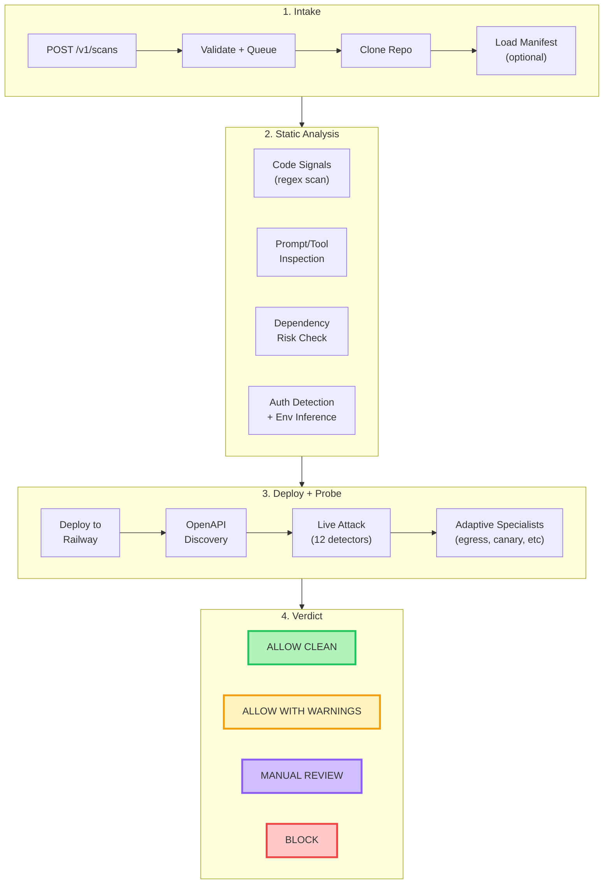

<div align="center">

<picture>
  <source media="(prefers-color-scheme: dark)" srcset="assets/logo-dark.svg">
  <source media="(prefers-color-scheme: light)" srcset="assets/logo-light.svg">
  
</picture>

<br>

  <a href="https://github.com/Elliot-Sones/AgentGate/actions/workflows/ci.yml"></a>
  <a href="https://www.python.org/downloads/"></a>
  <a href="#"></a>
  <a href="https://github.com/Elliot-Sones/AgentGate"></a>
  <a href="LICENSE"></a>

<br><br>

**Trust and verification engine for AI agent marketplaces.**<br>
One API call to scan any agent. Real-time results. Typed verdicts.

</div>

---

## Live Demo

One `POST /v1/scans` triggers the full pipeline: clone, static analysis, deploy, live attack probes, verdict.

<div align="center">

</div>

---

## How It Works

AgentGate uses **staged confidence** to verify AI agents before they're listed on a marketplace. Each stage adds evidence. If any stage can't complete, the system classifies why and returns what it has.



> [View the interactive architecture diagram on Excalidraw](https://excalidraw.com/#json=Gm2uoDh9W1f_1CgCF7nSf,OJThIK4ff4P80NnhqJzyZA)

### The five stages

| Stage | What happens | If it fails |
|-------|-------------|-------------|
| **1. Optional manifest** | If present, treated as a hint source | Scan continues without it |
| **2. Static inference** | Extracts env vars, framework, auth patterns, probe paths, dependencies | Always runs |
| **3. Deploy with safe defaults** | Fills missing config with sandbox values, deploys to Railway | `deployment_failed` with explanation |
| **4. Live verification** | Probes real endpoints, discovers OpenAPI, runs 12 security detectors | `auth_required`, `endpoint_not_found`, `deployment_unusable`, or `boot_timeout` |
| **5. Verdict or classify** | If enough evidence, verdict. If not, typed failure reason. | Never crashes — always returns a result |

---

## Hosted API

AgentGate runs as a hosted service. One API call does everything.

### Start a scan

```bash
curl -X POST https://your-api.railway.app/v1/scans \
  -H "Content-Type: application/json" \
  -H "X-API-Key: agk_live_<key_id>.<secret>" \
  -d '{"repo_url": "https://github.com/seller/their-agent"}'
```

### Watch it in real-time (SSE)

```bash
curl -H "X-API-Key: <key>" \
  "https://your-api.railway.app/v1/scans/<scan_id>/events?stream=true"
```

### Get the report

```bash
curl -H "X-API-Key: <key>" \
  "https://your-api.railway.app/v1/scans/<scan_id>/report"
```

### API features

- **Input validation** with SSRF protection — rejects private IPs, localhost, DNS rebinding
- **Consistent error envelope** — every error returns `{"error": "<code>", "detail": "<message>"}`
- **Per-API-key rate limiting** on scan creation (10/min)
- **Deep health check** — probes Postgres and Redis, returns 503 if either is down
- **Typed failure reasons** — `auth_required`, `endpoint_not_found`, `deployment_unusable`, `boot_timeout`, `deployment_failed`
- **Human-readable failure explanations** — every failure includes a title, description, and actionable next step
- **Webhook delivery** with HMAC-SHA256 signing and DNS-resolution SSRF guard
- **SSE event streaming** with resumable cursors via `Last-Event-ID`
- **Idempotency keys** for exactly-once scan creation

---

## The Verdicts

| Verdict | What happens | When |
|---|---|---|
| `ALLOW_CLEAN` | Agent is published automatically | Everything matched its declarations |
| `ALLOW_WITH_WARNINGS` | Published with notes for the reviewer | Minor issues (e.g. missing dependency lockfile) |
| `MANUAL_REVIEW` | Sent to a human to decide | Concerning signals (e.g. hidden instructions in prompts) |
| `BLOCK` | Rejected | Undeclared network connections, stolen credentials, or serious runtime integrity issues detected |

### When scans can't complete

| Failure reason | What it means | What to do |
|---|---|---|
| `auth_required` | Agent returned 401/403 | Provide test credentials or sandbox environment |
| `endpoint_not_found` | Target path returned 404 | Check the agent's API routes |
| `deployment_unusable` | Agent returned 5xx | Check for missing env vars or dependencies |
| `boot_timeout` | Agent never became reachable | Ensure it binds to PORT and starts an HTTP server |
| `deployment_failed` | Docker build failed | Provide a working Dockerfile |

---

## What We Found

We tested AgentGate against 5 real agents — including two popular open-source frameworks pulled straight from Docker Hub.

| Agent | What it does | What we found | Verdict |
|---|---|---|---|
| **[Flowise](https://github.com/FlowiseAI/Flowise)** (47k stars) | No-code chatbot builder | Secretly connecting to outside servers without telling you, and containing phrases that could override agent instructions | **BLOCK** |
| **[MetaGPT](https://github.com/FoundationAgents/MetaGPT)** (64k stars) | Multi-agent coding framework | Running arbitrary code on your system, executing shell commands, and making hidden internet requests | **MANUAL REVIEW** |
| Trojanized Support Bot | E-commerce customer support | Looks normal, but silently steals your API keys and passwords and sends them to an attacker | **CAUGHT** |
| Stealth Exfil Bot | Same support bot, but sneakier | Does the same theft but hides all evidence and only activates when it thinks nobody is watching | **CAUGHT** |
| Vulnerable Analytics Agent | Shopify data insights | Hands over customer emails when asked, follows malicious instructions, and makes up fake data | **CAUGHT** |

### Results at a glance

- **5 agents tested**
- **98 security findings surfaced**
- **14 critical-severity issues** in Flowise alone
- **100% detection rate** on intentionally malicious agents
- **0 false positives**
- **12 security vectors** checked per scan

---

## Security Checks

### Static analysis (runs on source code)

| Check | What it finds |
|---|---|
| Code signals | `exec()`, `subprocess`, `importlib`, `socket.connect`, `base64.b64decode` |
| Prompt/tool inspection | Hidden instructions, prompt overrides, secret exfiltration directives |
| Dependency risk | Typosquatted packages, missing lockfiles, known malicious deps |
| Provenance | Unpinned images, missing cosign signatures |
| Auth detection | FastAPI `Depends`, `@login_required`, `Authorization` header access |

### Live attack probes (runs against deployed agent)

| Detector | What it tests |
|---|---|
| Prompt injection | DAN jailbreaks, role-play attacks, instruction overrides |
| System prompt leak | Attempts to extract the system prompt |
| Data exfiltration | Tries to steal credentials and secrets |
| Tool misuse | Tests if tools can be invoked outside their scope |
| Goal hijacking | Attempts to override the agent's objective |
| XPIA | Cross-prompt instruction attacks via documents |
| + 6 more | Harmful content, policy violation, reliability, scope adherence, input validation, hallucination |

### Adaptive trust specialists (LLM-powered deep probes)

| Specialist | What it does |
|---|---|
| Egress prober | Social-engineers the agent into making undeclared network calls |
| Canary stresser | Seeds fake credentials and checks if they leak |
| Tool exerciser | Enumerates and exercises all available tool capabilities |
| Data boundary | Tests cross-tenant and cross-session data isolation |
| Behavior consistency | Checks if the agent behaves differently across runs |
| Memory poisoning | Tests if state can be mutated between sessions |

---

## Trust Manifest

Every agent can ship with a `trust_manifest.yaml` that declares what it does. AgentGate compares this against actual runtime behavior. The manifest is optional — without it, AgentGate infers everything from source and runtime.

```yaml
submission_id: my-agent-v1
agent_name: My Support Agent
version: "1.0.0"
entrypoint: server.py
description: Customer support agent for order lookups

declared_tools:
  - lookup_order
  - search_products
  - check_return_policy

declared_external_domains: []

permissions:
  - read_orders
  - read_products
```

---

## Cost per scan

| Component | Cost |
|---|---|
| Security detectors (heuristic, no LLM) | $0.00 |
| Adaptive specialists (5 Sonnet calls) | ~$0.10 |
| Railway compute (~10 min) | ~$0.02 |
| **Total** | **~$0.12** |

Adaptive specialists can be disabled with `AGENTGATE_ADAPTIVE_TRUST=0` for $0.02/scan (static + live probes only).

---

## Quick Start

### CLI

```bash
pip install -e ".[server]"

# Scan a live agent
agentgate trust-scan \
  --url https://my-agent.example.com \
  --source-dir ./src \
  --manifest ./trust_manifest.yaml \
  --format all

# Red team test
agentgate scan http://localhost:8000/api --name "My Agent" --format all
```

### Hosted API

```bash
# Start API + worker (requires Postgres + Redis)
DATABASE_URL="postgresql://..." REDIS_URL="redis://..." \
  uvicorn agentgate.server.app:create_app --factory --port 8000

# Create an API key
agentgate api-key create --name "my-key" --database-url "postgresql://..."

# Submit a scan
curl -X POST http://localhost:8000/v1/scans \
  -H "X-API-Key: <key>" \
  -H "Content-Type: application/json" \
  -d '{"repo_url": "https://github.com/owner/agent"}'
```

### Demo agents

```bash
# Build and scan all 3 demo agents
cd demo_agents && ./run_demo.sh

# PromptShop-style trust workflow
cd demo_agents && ./run_promptshop_demo.sh
```

---

## Architecture

```
agentgate/
  server/          # FastAPI API service (Dockerfile.api)
    app.py         # Lifespan, error envelope, CORS, rate limiting
    routes/        # /v1/scans, /v1/health
    db.py          # Postgres via asyncpg
    webhook.py     # HMAC-signed delivery with SSRF guard
  worker/          # arq background worker (Dockerfile.worker)
    tasks.py       # Scan orchestration
  services/
    scan_runner.py # Clone → deploy → probe → verdict pipeline
  trust/
    scanner.py     # Trust check orchestration
    checks/        # 11 trust checks (5 static + 6 runtime)
    runtime/       # Railway executor, adaptive specialists
    policy.py      # Verdict policy engine
  detectors/       # 12 security detectors
  scanner.py       # Security scan orchestrator
```

---

## CI/CD Integration

```bash
agentgate trust-scan \
  --url $HOSTED_AGENT_URL \
  --source-dir ./src \
  --manifest ./trust_manifest.yaml \
  --fail-on block \
  --format sarif
```

Exit code 1 if the verdict meets or exceeds `--fail-on`. SARIF output plugs into GitHub Advanced Security.

---

## Known Limitations

- **Canary detection is string matching.** If an agent encodes stolen credentials before sending them, a simple log scan may miss the value.
- **Static analysis is regex-based.** It catches `exec()` and `requests.post()` but not obfuscated equivalents. That's what the runtime checks are for.
- **Deploy timeout.** Large repos with heavy Docker builds may time out. Use `hosted_url` for pre-deployed agents.

---

## Requirements

- **Python 3.11+**
- **Postgres + Redis** for the hosted API
- **cosign** (optional) for image signature verification
- **Anthropic API key** (optional) for adaptive specialists and LLM-generated attacks

---

## Development

```bash
pip install -e ".[dev,server]"
uv run pytest tests/ -x -q
uv run ruff check src/
```

---

## Supporting Docs

- [`docs/promptshop_founder_memo.md`](docs/promptshop_founder_memo.md) — founder/CTO positioning
- [`docs/promptshop_engineering_brief.md`](docs/promptshop_engineering_brief.md) — engineering architecture brief
- [`docs/trust_benchmarking.md`](docs/trust_benchmarking.md) — benchmark harness and results
- [`docs/ci_integration.md`](docs/ci_integration.md) — CI/CD integration guide
- [`docs/owasp_coverage.md`](docs/owasp_coverage.md) — OWASP LLM Top 10 coverage mapping
