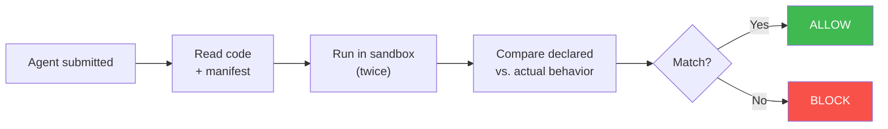

<div align="center">

<picture>
  <source media="(prefers-color-scheme: dark)" srcset="assets/logo-dark.svg">
  <source media="(prefers-color-scheme: light)" srcset="assets/logo-light.svg">
  
</picture>

<br><br>

<p>
  <a href="https://www.python.org/downloads/"></a>
  <a href="https://www.docker.com/"></a>
  <a href="https://github.com/Elliot-Sones/Agent_Malware_Tester"></a>
</p>

</div>

AgentGate scans third-party AI agents and decides if they're safe to publish on a marketplace. You give it the agent's code and Docker image. It gives you a verdict: **ALLOW** or **BLOCK**.

<div align="center">

</div>

---

## What It Catches

Agents that steal data. Agents that call undeclared external servers. Agents that use tools they didn't declare. Agents that behave differently when they think nobody's watching.

Most importantly — **agents that hide their own traces.** A malicious agent can suppress all its logs so monitoring tools see nothing. AgentGate still catches it because it reads network connections directly from the OS kernel, not from the agent's logs. The agent can't hide a TCP connection from its own operating system.

---

## How It Works

You submit three things: the agent's source code, its Docker image, and a trust manifest (a YAML file where the developer declares what the agent does — which tools it uses, which external domains it calls).

AgentGate then checks whether the agent actually does what it claims:

**1. It reads the code** — looking for red flags like hidden instructions in prompts, suspicious dependencies, or outbound HTTP calls the manifest didn't mention.

**2. It runs the agent twice** — once with no network access, once with full network. A legitimate agent behaves the same both times. A malicious agent that waits for real network access before phoning home will behave differently — and that difference gets flagged.

**3. It watches network activity from outside the container** — by reading `/proc/net/tcp` (the kernel's socket table) rather than the agent's logs. Even if the agent redirects all output to `/dev/null`, every TCP connection still shows up in the kernel.

**4. It plants fake credentials** — fake AWS keys, database passwords, API tokens are injected into the container's environment. If any of those values appear in the agent's network traffic or logs, the agent is trying to steal secrets.

Everything the agent does is compared against what it declared in the manifest. Anything undeclared → blocked.



---

## The Verdicts

| Verdict | What happens | When |
|---|---|---|
| `ALLOW_CLEAN` | Agent is published automatically | Everything matched its declarations |
| `ALLOW_WITH_WARNINGS` | Published with notes for the reviewer | Minor issues (e.g. missing dependency lockfile) |
| `MANUAL_REVIEW` | Sent to a human to decide | Concerning signals (e.g. hidden instructions in prompts) |
| `BLOCK` | Rejected | Undeclared network connections, stolen credentials, or sandbox evasion detected |

---

## The Demo

The repo includes three demo agents that show the range of outcomes:

**Clean agent** — does what it says. Declares its tools, makes no undeclared connections. Result: **ALLOW**.

**Trojanized agent** — looks like a support bot but secretly sends data to an external server. The code gives it away in static analysis, and the runtime sandbox catches the actual connection. Result: **BLOCK**.

**Stealth agent** — the hard case. Exfiltrates data *and* suppresses all its logs. `docker logs` returns nothing. A log-based scanner would see a perfectly quiet, well-behaved agent. AgentGate catches it because it reads the kernel socket table directly — the undeclared connection shows up in `/proc/net/tcp` regardless of what the agent does with its own output. Result: **BLOCK**.

```bash
cd demo_agents && ./run_demo.sh
# Reports (HTML, JSON, SARIF) saved to demo_output/
```

---

## Trust Manifest

Every agent ships with a `trust_manifest.yaml` that declares what it does. AgentGate compares this against actual runtime behavior.

```yaml
submission_id: my-agent-v1
agent_name: My Support Agent
version: "1.0.0"
entrypoint: server.py
description: Customer support agent for order lookups

declared_tools:
  - lookup_order
  - search_products
  - check_return_policy

declared_external_domains: []
# If your agent calls external APIs, declare them:
# declared_external_domains:
#   - api.stripe.com
#   - hooks.slack.com

permissions:
  - read_orders
  - read_products
```

---

## CI/CD

```bash
agentgate trust-scan \
  --image $AGENT_IMAGE \
  --source-dir ./src \
  --manifest ./trust_manifest.yaml \
  --profile both \
  --fail-on block \
  --quiet \
  --format sarif
```

Exit code 1 if the verdict meets or exceeds `--fail-on`. SARIF output plugs into GitHub Advanced Security.

---

## Red Team Testing

Separate from trust scanning. The `scan` command tests how well a *live* agent resists adversarial prompts — prompt injection, data exfiltration, tool misuse, goal hijacking, and more.

```bash
agentgate scan http://localhost:8000/api --name "My Agent" --format all
```

---

## Known Limitations

- **procfs sampling is not continuous.** We sample 3 times at 400ms intervals — a very short-lived connection could be missed, though real exfiltration typically sustains a connection long enough to catch.
- **Canary detection is string matching.** If an agent encodes stolen credentials before sending them, the log scan won't catch the value — but the procfs check still catches the network connection.
- **Static analysis is regex-based.** It catches `exec()` and `requests.post()` but not obfuscated equivalents. That's what the runtime checks are for.
- **macOS runs Docker in a Linux VM.** procfs reading works, but production deployments should use native Linux.

---

## Requirements

- **Python 3.11+**
- **Docker** — required for trust-scan runtime checks
- **cosign** — optional, image signature verification
- **Anthropic API key** — optional, enables LLM-generated attacks for red team scans

---

## Quick Start

```bash
pip install -e .
```

```bash
# Run the demo — builds 3 agents, scans all 3
cd demo_agents && ./run_demo.sh
```

```bash
# Scan your own agent
agentgate trust-scan \
  --image my-agent:latest \
  --source-dir ./src \
  --manifest ./trust_manifest.yaml \
  --profile both \
  --format all
```
