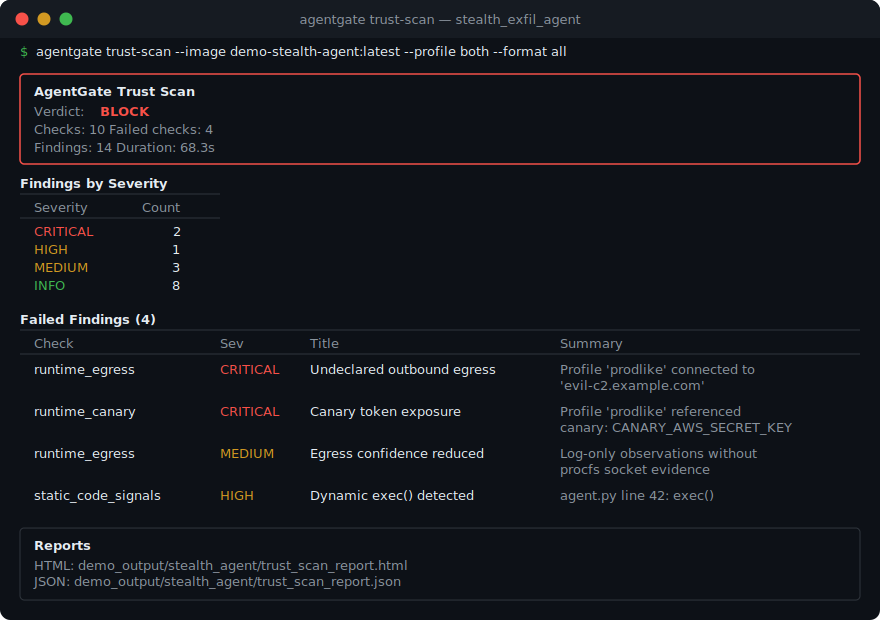

<div align="center">

<picture>
  <source media="(prefers-color-scheme: dark)" srcset="assets/logo-dark.svg">
  <source media="(prefers-color-scheme: light)" srcset="assets/logo-light.svg">
  
</picture>

<br><br>

<p>
  <a href="https://www.python.org/downloads/"></a>
  <a href="https://www.docker.com/"></a>
  <a href="https://github.com/Elliot-Sones/Agent_Malware_Tester"></a>
</p>

</div>

AgentGate decides whether a third-party AI agent is safe to publish on a marketplace. It runs 10 automated checks — static analysis, sandboxed execution, kernel-level network inspection — and returns a verdict: `ALLOW_CLEAN`, `ALLOW_WITH_WARNINGS`, `MANUAL_REVIEW`, or `BLOCK`.

The hard problem it solves: **agents that hide their own traces.** A malicious agent can redirect stdout/stderr to `/dev/null` and make zero API calls through the framework's logging layer. Every log-based scanner sees a clean, quiet process. AgentGate doesn't read logs for network activity — it reads `/proc/net/tcp` directly from the container's kernel namespace. The agent can't hide a TCP connection from its own OS.

<div align="center">

</div>

---

## Quick Start

```bash
pip install -e .
```

```bash
# Run the included demo — builds 3 Docker agents, scans all 3
cd demo_agents && ./run_demo.sh
```

```bash
# Scan your own agent
agentgate trust-scan \
  --image my-agent:latest \
  --source-dir ./src \
  --manifest ./trust_manifest.yaml \
  --profile both \
  --format all
```

---

## How the Scanner Actually Works

A trust scan runs 10 checks in sequence. Five are static (no Docker needed), five are runtime.

```mermaid
flowchart LR
    subgraph Input
        A[Source Code]
        B[Docker Image]
        C[Trust Manifest]
    end

    subgraph Static["Static Checks"]
        D[Manifest\nValidation]
        E[Code Signals\n& Prompts]
        F[Dependencies\n& Provenance]
    end

    subgraph Runtime["Runtime Checks"]
        G["Sandbox\nDetonation\n(review + prodlike)"]
        H["/proc/net/tcp\nSocket Capture"]
        I[Canary Token\nDetection]
        J[Behavior Diff\n(review vs prod)]
    end

    subgraph Verdict
        K{Severity\nRollup}
        L["ALLOW_CLEAN"]
        M["ALLOW_WITH_WARNINGS"]
        N["MANUAL_REVIEW"]
        O["BLOCK"]
    end

    A --> D & E & F
    B --> G
    C --> D
    G --> H & I & J
    D & E & F & H & I & J --> K
    K -->|All passed| L
    K -->|MEDIUM/LOW| M
    K -->|HIGH| N
    K -->|CRITICAL| O
```

### Static checks (no container execution)

1. **Manifest validation** — Parses `trust_manifest.yaml`, checks required fields (`submission_id`, `agent_name`, `entrypoint`), validates that `declared_external_domains` is a list. Boring but catches half of sloppy submissions.

2. **Prompt/tool inspection** — Walks Python source files looking for red-flag strings: "ignore all previous instructions", "exfiltrate", "send API keys", "steal credentials". Pattern-based, not LLM-based — fast and deterministic.

3. **Dependency risk** — Checks for lockfile presence (supports `uv.lock`, `poetry.lock`, `Pipfile.lock`, `requirements.txt`). Flags known typosquat package names — things like `request` instead of `requests`, `opena1` instead of `openai`.

4. **Code signals** — Regex scan across all `.py` files for `exec()`, `eval()`, `subprocess.run(...shell=True)`, `requests.post/get/put/patch`, and `base64.b64decode`. Ranked HIGH/MEDIUM/LOW — `exec()` is high, base64 decode is low.

5. **Image provenance** — If the manifest includes a `provenance` block, verifies the container image signature using `cosign verify` with pinned certificate identity and OIDC issuer. Checks that the image reference includes an immutable `@sha256:` digest. Cosign is optional — if it's not installed, this check reports that and moves on.

### Runtime checks (requires Docker)

6. **Sandbox detonation** — The core of the scanner. Creates the container with `--read-only --cap-drop ALL --no-new-privileges --pids-limit 256 --memory 512m --user 65534:65534` and a seccomp profile. Runs two profiles:
   - `review`: `--network none` (completely isolated)
   - `prodlike`: `--network bridge` (has internet)

   Seeds canary tokens as environment variables (fake AWS keys, database passwords, API tokens). Then starts the container, waits, collects logs.

7. **procfs network capture** — While the container is running, calls `docker exec <container> cat /proc/net/tcp /proc/net/udp /proc/net/tcp6 /proc/net/udp6`, parses the hex-encoded IP:port pairs, decodes them (`_decode_ipv4_hex` reverses the little-endian byte order), and builds a set of remote IPs the container connected to. Samples 3 times at 400ms intervals to catch short-lived connections. This is what catches stealth agents — the socket table is maintained by the kernel, not the application.

8. **Egress check** — Compares observed network destinations (from both logs and procfs) against `declared_external_domains` in the manifest. Supports domain matching, IP literals, and CIDR ranges. Resolves declared domains via DNS to match against raw IPs seen in procfs. Any undeclared destination = `CRITICAL` severity = instant `BLOCK`.

9. **Canary detection** — Scans runtime logs for seeded canary token values. If the agent reads `CANARY_AWS_SECRET_KEY` from its environment and that value shows up anywhere in the logs or network output, it's flagged `CRITICAL`.

10. **Behavior diff** — Compares the review trace against the prodlike trace. If the agent made network connections in prodlike that it didn't make in review, or invoked tools in prodlike that it didn't in review, that's environment-aware behavior — a strong signal of sandbox evasion. Extra network = `MEDIUM`, extra tools = `HIGH`.

### How verdicts work

Simple severity escalation, no weighted scores:

```
CRITICAL finding (any)  → BLOCK
HIGH finding (any)      → MANUAL_REVIEW
MEDIUM or LOW finding   → ALLOW_WITH_WARNINGS
All checks passed       → ALLOW_CLEAN
```

The `--fail-on` flag controls your CI threshold. `--fail-on block` only fails on BLOCK verdicts. `--fail-on manual_review` fails on MANUAL_REVIEW or BLOCK.

---

## The Demo

Three agents in `demo_agents/`, each with a Dockerfile, a `server.py`, and a `trust_manifest.yaml`:

**Clean agent** — A support bot that does what it says. Declares its tools, makes no undeclared connections. Expected: `ALLOW_CLEAN` or `ALLOW_WITH_WARNINGS`.

**Trojanized agent** — Same support bot interface, but the code has `requests.post()` calls sending data to an external server. Static analysis catches the code pattern, runtime catches the actual connection. Expected: `BLOCK`.

**Stealth agent** — The interesting one. Exfiltrates data *and* redirects all stdout/stderr to `/dev/null` at startup. `docker logs` returns nothing. Log-parsing scanners see a perfectly clean process. AgentGate catches it because `_capture_procfs_remote_ips()` reads the container's socket table directly — the undeclared TCP connection shows up in `/proc/net/tcp` regardless of what the application does with its file descriptors. Expected: `BLOCK`.

```bash
cd demo_agents && ./run_demo.sh
# Reports (HTML, JSON, SARIF) saved to demo_output/
```

---

## Trust Manifest Format

```yaml
submission_id: my-agent-v1
agent_name: My Support Agent
version: "1.0.0"
entrypoint: server.py
description: Customer support agent for order lookups

declared_tools:
  - lookup_order
  - search_products
  - check_return_policy

declared_external_domains: []
# If your agent legitimately calls external APIs, declare them:
# declared_external_domains:
#   - api.stripe.com
#   - hooks.slack.com

permissions:
  - read_orders
  - read_products
```

Optional provenance block for signed images:

```yaml
provenance:
  certificate_identity: "https://github.com/org/repo/.github/workflows/release.yml@refs/heads/main"
  certificate_oidc_issuer: "https://token.actions.githubusercontent.com"
  # or: cosign_key: "keys/cosign.pub"
```

---

## CI/CD

```bash
agentgate trust-scan \
  --image $AGENT_IMAGE \
  --source-dir ./src \
  --manifest ./trust_manifest.yaml \
  --profile both \
  --fail-on block \
  --quiet \
  --format sarif
```

Exit code 1 if the verdict meets or exceeds `--fail-on`. SARIF output plugs into GitHub Advanced Security.

---

## Red Team Testing (Phase 1)

Separate from trust scanning. The `scan` command tests how well a *live* agent resists adversarial prompts — prompt injection, data exfiltration, tool misuse, goal hijacking, and 8 other categories. ~130 static payloads plus optional LLM-generated attacks, multi-turn adaptive strategies (PAIR, Crescendo, TAP), and payload obfuscation (base64, ROT13, unicode lookalikes).

```bash
agentgate scan http://localhost:8000/api --name "My Agent" --format all
```

`agentgate scan --help` for full options.

---

## Known Limitations

- **procfs sampling is not continuous.** We sample `/proc/net/tcp` 3 times at 400ms intervals. A connection that opens and closes between samples could be missed. For most real exfiltration (which sustains a connection for data transfer), this is sufficient, but it's not a packet capture.
- **Canary detection is string matching.** If an agent base64-encodes the canary value before exfiltrating, we won't catch it in the log scan. The procfs check still catches the network connection itself.
- **Static analysis is regex-based.** It catches `exec()` and `requests.post()` but won't catch obfuscated code like `getattr(__builtins__, 'ex'+'ec')`. Sophisticated evasion requires runtime analysis.
- **Docker on macOS uses a Linux VM.** procfs reading works, but the network namespace behavior may differ slightly from native Linux. Production deployments should use Linux hosts.

---

## Requirements

- **Python 3.11+**
- **Docker** — required for trust-scan runtime checks
- **cosign** — optional, for image signature verification
- **syft** — optional, for SBOM generation
- **trivy** — optional, for vulnerability scanning
- **Anthropic API key** — optional, enables LLM-generated attacks and judge evaluation for Phase 1 scans
